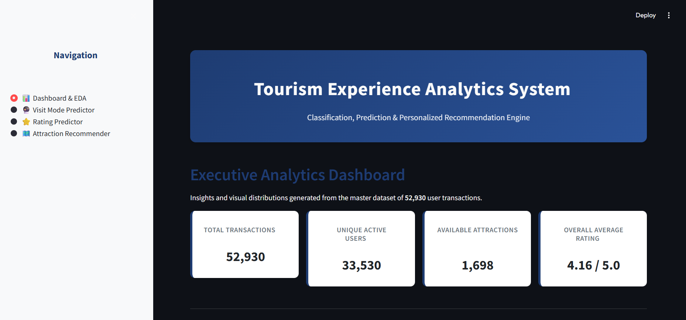
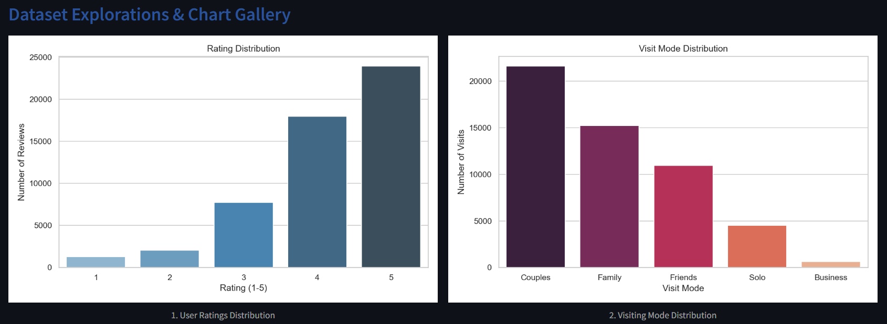
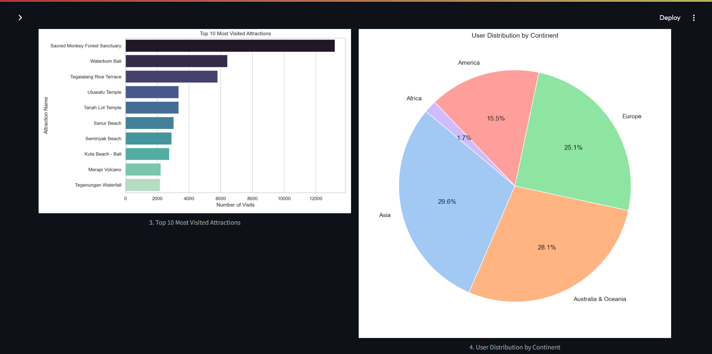
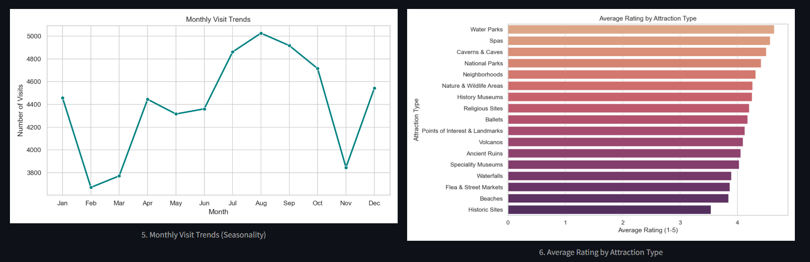
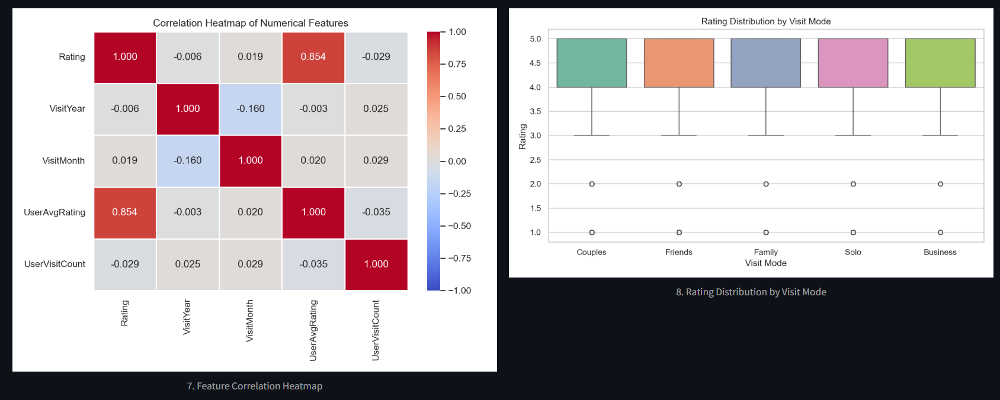
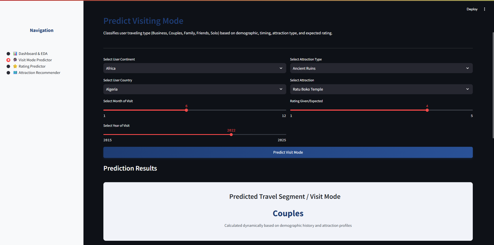
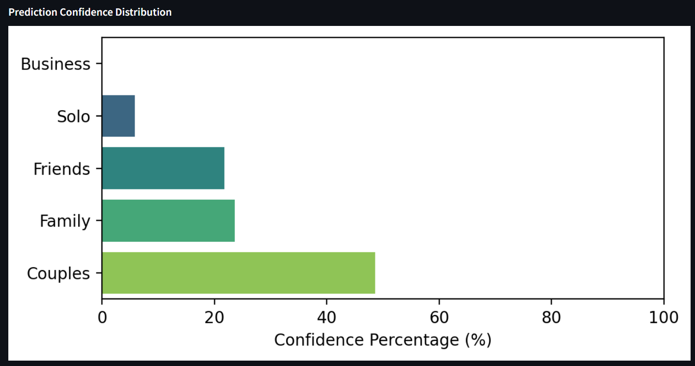
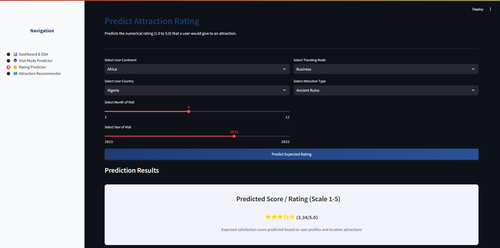
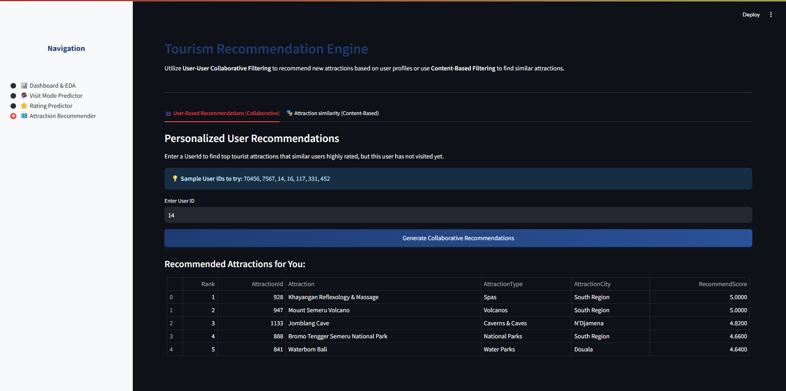
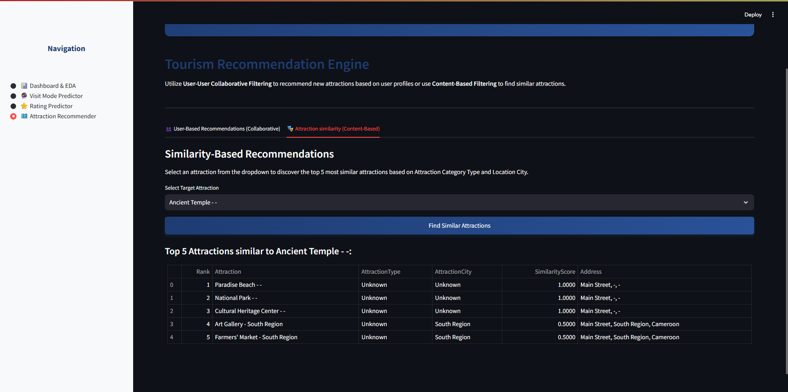

# Tourism Experience Analytics: Classification, Prediction, and Recommendation System

An end-to-end Python data science application for analyzing tourism data, predicting visitor behavior, estimating ratings, and offering personalized recommendations.

---

## Project Structure & Files

The project consists of 6 core Python scripts that are fully independent and must be executed in order:

1. **`data_preprocessing.py`**: Loads 10 Excel files, merges tables, decodes IDs, cleans missing values and `-` placeholders, feature engineers user-level aggregates, label-encodes categories, scales numeric features, and exports `cleaned_data.csv`, `label_encoders.pkl`, and `scalers.pkl`.
2. **`eda_visualization.py`**: Generates and saves 8 plots to the `plots/` folder and prints key tourism statistics.
3. **`regression_model.py`**: Trains and evaluates Linear Regression, Random Forest, and XGBoost Regressor to predict rating values, and saves the best model as `best_regression_model.pkl`.
4. **`classification_model.py`**: Trains and evaluates Random Forest, XGBoost, and LightGBM Classifiers to predict traveling segments, displays a confusion matrix, and saves the best model as `best_classification_model.pkl`.
5. **`recommendation_system.py`**: Evaluates collaborative filtering using RMSE on a test set, builds user-item rating matrices and content attraction feature vectors (1,698 attractions), and saves lookups as `.pkl` matrices.
6. **`app.py`**: A multi-page Streamlit application rendering the analytics dashboard, traveling segment classifier, attraction rating predictor, and personalized recommendations.

---

## Installation & Setup

1. **Clone the Repository**:
   Make sure you are inside the project root folder.

2. **Install Dependencies**:
   Execute the following command to install the required libraries:
   ```bash
   pip install -r requirements.txt
   ```

---

## How to Execute the Pipeline

Run the scripts in the following order to prepare data, train models, and launch the application:

### Step 1: Preprocess Data
Merges all lookups and transactional datasets, cleans files, and creates scaled/encoded inputs:
```bash
python data_preprocessing.py
```

### Step 2: Generate Exploratory Visualizations
Generates all 8 statistical plots and saves them in the `plots/` directory:
```bash
python eda_visualization.py
```

### Step 3: Train Regression Model
Compares models and trains the best rating predictor:
```bash
python regression_model.py
```

### Step 4: Train Classification Model
Compares classifiers and trains the best traveling mode segment classifier:
```bash
python classification_model.py
```

### Step 5: Initialize Recommendation Matrices
Builds collaborative filtering matrices, computes item similarity, and runs evaluation:
```bash
python recommendation_system.py
```

### Step 6: Launch the Streamlit App
Start the interactive dashboard web server locally:
```bash
streamlit run app.py
```
After running, a browser window will automatically open at `http://localhost:8501`.

---

## Dashboard Pages

- **📊 Dashboard & EDA**: View metric cards of overall stats alongside 8 pre-saved analysis charts highlighting demographics, popularity, trends, and correlations.
- **🔮 Visit Mode Predictor**: Interactively enter continent, country, timing, and category to classify travel mode classes (Couples, Solo, Business, etc.) alongside confidence distribution plots.
- **⭐️ Rating Predictor**: Input traveler details to forecast an expected attraction rating, displayed as a visual star rating (e.g. ⭐⭐⭐⭐½).
- **🗺️ Attraction Recommender**: Get personalized collaborative recommendations for active User IDs (e.g., `70456`, `7567`, `14`), or find top 5 similar attractions for any selected attraction out of 1,698 options.

---

## 🖥️ Streamlit App Preview

Below are screenshots of the interactive pages and features within the Tourism Experience Analytics Streamlit application:

### 1. Executive Analytics Dashboard & EDA
Displays key high-level dataset metrics (Total Transactions, Unique Active Users, Available Attractions, and Overall Average Rating) along with a grid of 8 detailed data visualization plots.

<p align="center">
  
  
</p>

<p align="center">
  
  
</p>

### 2. Traveling Visit Mode Predictor
Classifies user traveling type (Business, Couples, Family, Friends, Solo) based on user demographics, visit timing, and target attraction type, showcasing a probability confidence distribution bar chart.

<p align="center">
  
  
</p>

### 3. Attraction Rating Predictor
Estimates the user satisfaction rating (scale of 1.0 to 5.0) that a tourist is expected to give to a destination, outputting the result with a dynamic star-rating layout.

<p align="center">
  
  
</p>

### 4. Tourism Recommendation Engine
Generates User-User Collaborative recommendations for a specific User ID (e.g., `70456`), or filters similar attractions based on location and category profile using Content-Based similarity.

<p align="center">
  
  
</p>